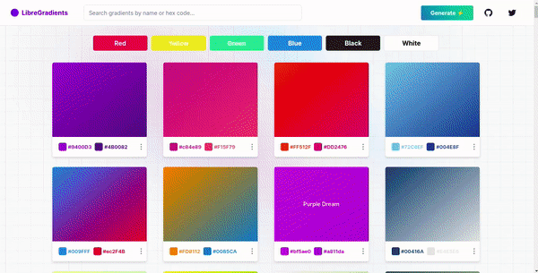

# LibreGradients

LibreGradient is an open-source collections of beautiful gradient colors.

The goal of LibreGradients is to provide everyone with free access to a collection of beautiful and modern gradients for their next project.

Official site: [https://libre-gradients.vercel.app](https://libre-gradients.vercel.app)

## ⚒️ Demo

Browse through a list of over 284 beautiful and modern gradients.

## ⭐ Features

It has 5 Core Features:
| 
**Feature**
 | **Description** |
|---|---|
| **1. Copy CSS Code** | You can easily copy the CSS code of any gradient you select |
| **2. In-built Editor** | Easily customize your gradients to fit your specific use-case.|
| **3. Palette Extractor** | Upload any image of your choice and with our extractor, we can generate beautiful color palettes for you |
| **4. Export as PNG** | Download any gradient in PNG formats locally to your computer (more formats coming soon)|
| **5. Easy Search** | Easily search gradients by name or hex code |

## 📚 Tech Stack

| 
**Category**
 | 
**Choice**
                   | **Descriptions**                                                                                                                     |
| ------------------------------------------- | ----------------------------------------------------------- | ------------------------------------------------------------------------------------------------------------------------------------ |
| **Language**                                | [TypeScript](https://github.com/microsoft/TypeScript)       | TypeScript is JavaScript with static type checking and helps catch many silly bugs at code time.                                     |
| **UI Library**                              | [React](https://github.com/facebook/react)                  | React’s declarative syntax and component-based architecture make it simple to develop reactive reusable components.                  |
| **State Management**                        | [Zustand](https://github.com/reduxjs/redux-toolkit)         | Zustand is a small, fast and scalable bearbones state-management solution, it has a comfy api based on hooks.                        |
| **CSS Framework**                           | [Tailwind CSS](https://github.com/tailwindlabs/tailwindcss) | Tailwind speeds up development by providing helpful css utilities and removing the need to context switch between tsx and css files. |
| **Web Framework**                           | [NextJS 13](https://github.com/vercel/next.js)              | Next.js supports static site generation and helps build efficient React webpages that support SEO.                                   |

## 📁 Project Structure

LibreGradients is created with the NextJS web framework and follows its project structure.

| 
**Page Route**
 | **Code Path**  | **Description**                                   |
| --------------------------------------------- | -------------- | ------------------------------------------------- |
| /                                             | /index.tsx     | Home page that contains the list of all gradients |
| /components                                   | /components    | Contains all the components used in the project   |
| /ui                                           | /ui/           | Contains radix and shadcn ui utility components   |
| /generate                                     | /generate.tsx/ | Contains logic for extracting colors from images  |
| /[color]                                      | /[color].tsx/  | Individual page for each gradient                 |

## 💻 Local Development

1. Download the repo `git clone https://github.com/urdadx/libre-gradients.git`
2. Change the directory `cd libre-gradients`
3. Install the dependency `npm install`
4. Start a development server `npm run dev`
5. Open your browser and visit [http://localhost:3000](http://localhost:3000) to see LibreGradients live

## Contributing 🤝

We love our contributors! Here's how you can contribute:

- [Open an issue](https://github.com/urdadx/libre-gradients/issues) if you believe you've encountered a bug.
- Make a [pull request](https://github.com/urdadx/libre-gradients/pull) to add new features/make quality-of-life improvements/fix bugs.

## Repo Activity

## Give this repo a star ⭐.
